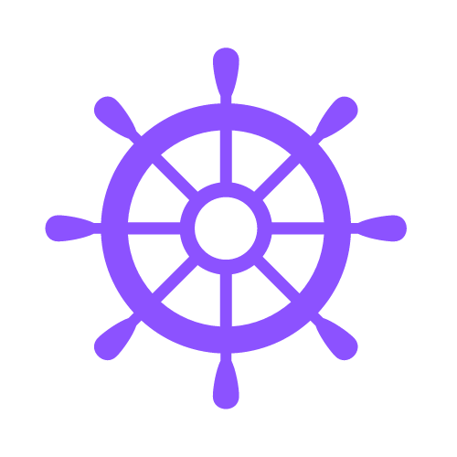
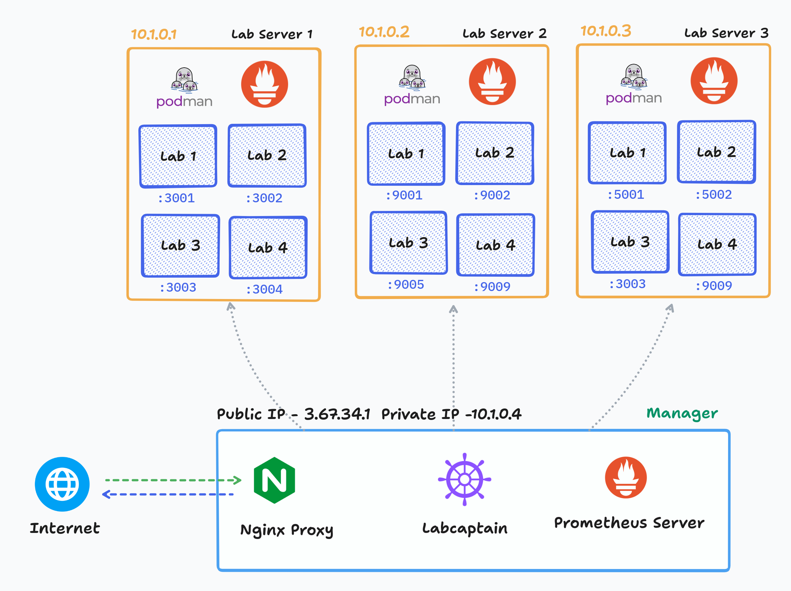
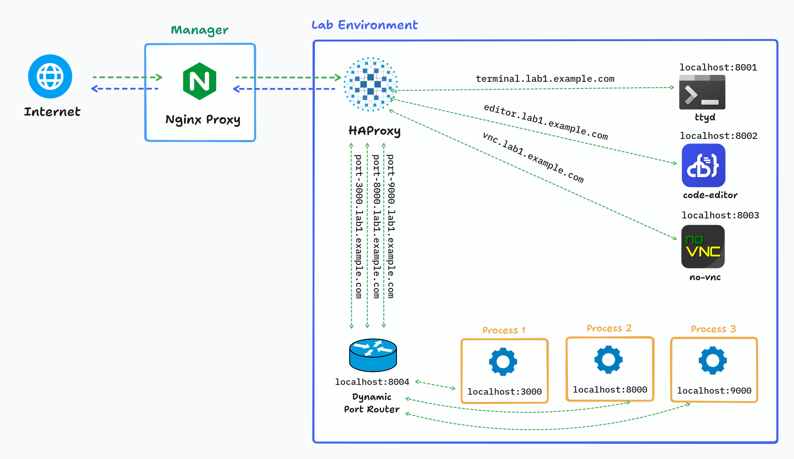

### What is LabCaptain ?
LabCaptain is a tiny daemon + CLI tool that helps to deploy lab environment in cluster.

### Why LabCaptain ?
I have planned to build a lab environment or dev platform first.
Then thought about this abstraction layer which will help to build and deploy lab environment easily.
So, I decided to build this lightweight tool to manage it.

The name `LabCaptain` is due to the fact that it takes the responsibility of lab environment management. You will just say it you need to deploy a lab environment for certain period of time and it will do the task.

Now, the most interesing part is -
1. Labcaptain providing docker base image, so that you can build your own lab environment easily.
```
registry.hub.docker.com/tanmoysrt/labcaptain_base
```
2. Labcaptain providing API to manage lab environment.
3. Web terminal, code server, VNC, port forwarding out of the box.
- https://terminal.{lab_id}.example.com : Web terminal
- https://editor.{lab_id}.example.com : Code server (VSCode like)
- https://vnc.{lab_id}.example.com : VNC
- https://port-{port_no}.{lab_id}.example.com : Port forwarding out of the box. You can run your own tool inside the container and access it via the url format. Just small restrictions - you cant use 8000, 8001, 8002, 8003, 8004 ports.

To know more, how can you disable specific feature like VNC, check the image documentation.
https://hub.docker.com/r/tanmoysrt/labcaptain_base

### Tech Stack
- Golang
- SQLite3 (for database)
- Podman
- Prometheus (for monitoring)
- HAProxy
- NoVNC + noVNC proxy
- ttyd

### System Architecture


### Lab Architecture (Labcaptain Docker Image)


### Installation guide (Ubuntu 22.04)
1. Install golang (https://go.dev/doc/install)
2. Clone the repo
3. Go inside `labcaptain` folder
4. Run `go build` to build the binary
5. Move the `labcaptain` binary to `/usr/local/bin`
6. Run `labcaptain local-setup` to setup labcaptain on the local machine
7. Run `labcaptain server add <ip>` to add a new server
8. Run `labcaptain server list` to list all servers
9. Run `labcaptain server setup-podman <ip>` to setup podman on the server
10. Run `labcaptain server setup-prometheus <ip>` to setup prometheus exporter on the server
11. Run `labcaptain server enable <ip>` to enable a server
12. Create a systemd service file `/etc/systemd/system/labcaptain.service`
```bash
[Unit]
Description=LabCaptain
After=network.target

[Service]
User=root
Type=simple
Environment="LAB_CAPTAIN_BASE_DOMAIN=example.com"
Environment="LABCAPTAIN_API_TOKEN=random_secret"
ExecStart=/usr/local/bin/labcaptain
Restart=always
RestartSec=10

[Install]
WantedBy=multi-user.target
```
13. Run `systemctl daemon-reload` and `systemctl enable labcaptain`
14. Run `systemctl start labcaptain` to start labcaptain

**Note:** Your server may have not ssh-agent installed. Run `echo $SSH_AUTH_SOCK` to check if it's installed.

- Generate a ssh private key for all of your other servers (if you haven't already)
  ```bash
  ssh-keygen -t rsa -b 4096 -C "your_email@example.com"
  ```
  Put the private key in `/root/.ssh/id_rsa` and the public key in `/root/.ssh/id_rsa.pub`

- Add the public key to all of your other servers
- Create/edit `/etc/rc.local` file and add the following line
  ```bash
  eval $(ssh-agent -s)
  ssh-add /root/.ssh/id_rsa
  ```
  and make that file executable with `chmod +x /etc/rc.local` and reboot the server.

### API Documentation
1. Deploy a lab
  - Method: POST
  - URL: http://localhost:8888/start
  - Body:
    ```json
    {
      "image": "registry.hub.docker.com/tanmoysrt/labcaptain_base:1",
      "expiry_time": "2024-09-21T13:04:05Z",
      "web_terminal_enabled": true,
      "code_server_enabled": true,
      "vnc_enabled": true,
      "port_proxy_enabled": true,
      "environment_variables": ""
    }
    ```
  - Response:
    ```json
    {
      "id": "tqtw1fl7ku2imcp",
      "status": "requested",
      "expiry_time": "2024-01-01T00:00:00Z"
    }
    ```
2. Get lab status
  - Method: GET
  - URL: http://localhost:8888/status/:lab_id
  - Response:
    ```json
    {
      "id": "tqtw1fl7ku2imcp",
      "status": "provisioned",
      "expiry_time": "2024-01-01T00:00:00Z"
    }
    ```
3. Stop a lab
  - Method: POST
  - URL: http://localhost:8888/stop/:lab_id
  - Response:
    ```text
    Lab destroyed successfully
    ```
    If you got 200 OK, it means the lab is destroyed successfully.

### Future Work
-[] Implement SSH connection pool for faster communication
-[] Implement support for resource limits
-[] Configurable option for lab proxy at port 443 ssl (P.S : currently it's also possible by editing `labcaptain/nginx.conf.template`)
-[] Remote storage mount support

### License
MIT License

### Credits
Special thanks to these projects
- https://github.com/ConSol/docker-headless-vnc-container (Apache License 2.0). It made it possible to have proper configuration for Xfce4 + noVNC setup for headsup.
- https://github.com/tsl0922/ttyd (MIT License). It made it possible to have a web terminal.
- https://github.com/coder/code-server (MIT License). It made it possible to have a code server.
